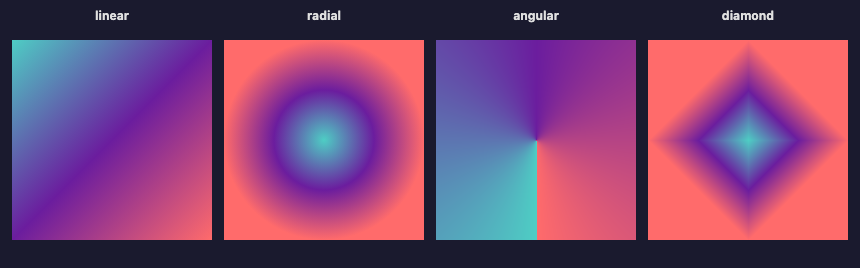
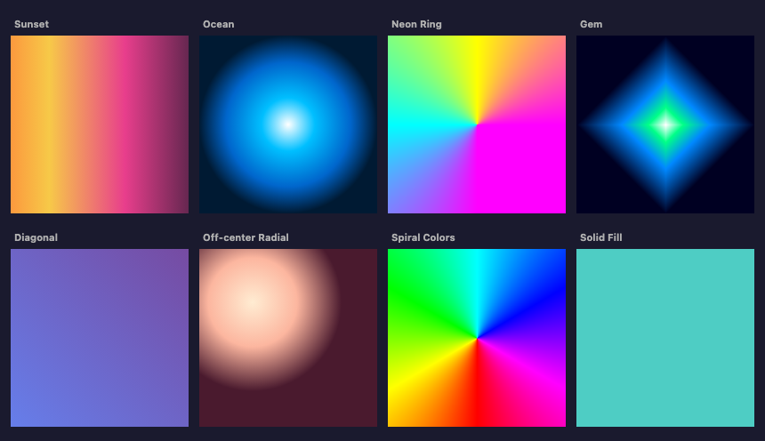

# @genart-dev/plugin-compositing

Compositing design layer plugin for [genart.dev](https://genart.dev) — solid fill, gradient fill (linear, radial, angular, diamond), image, and group layers with masking support. Includes MCP tools for AI-agent control.

Part of [genart.dev](https://genart.dev) — a generative art platform with an MCP server, desktop app, and IDE extensions.

## Examples





Source files: [gradient-types.genart](test-renders/gradient-types.genart) · [gradient-variations.genart](test-renders/gradient-variations.genart)

## Install

```bash
npm install @genart-dev/plugin-compositing
```

## Usage

```typescript
import compositingPlugin from "@genart-dev/plugin-compositing";
import { createDefaultRegistry } from "@genart-dev/core";

const registry = createDefaultRegistry();
registry.registerPlugin(compositingPlugin);

// Or access individual exports
import {
  solidLayerType,
  gradientLayerType,
  imageLayerType,
  groupLayerType,
  compositingMcpTools,
} from "@genart-dev/plugin-compositing";
```

## Layer Types

### Solid Fill (`composite:solid`)

Fills the layer bounds with a single color.

| Property | Type | Default | Description |
|----------|------|---------|-------------|
| `color` | color | `"#000000"` | Fill color |

### Gradient Fill (`composite:gradient`)

Fills with a gradient. Linear and radial use Canvas 2D gradient API; angular and diamond render per-pixel.

| Property | Type | Default | Description |
|----------|------|---------|-------------|
| `gradientType` | select | `"linear"` | `linear`, `radial`, `angular`, `diamond` |
| `stops` | string (JSON) | 2-stop black→white | `GradientStop[]` (min 2) |
| `angle` | number | `0` | Angle in degrees (0–360) |
| `centerX` | number | `0.5` | Center X (0–1) |
| `centerY` | number | `0.5` | Center Y (0–1) |
| `scale` | number | `1.0` | Scale (0.1–5) |

### Image (`composite:image`)

Renders a sketch asset with fit and anchor control.

| Property | Type | Default | Description |
|----------|------|---------|-------------|
| `assetId` | string | `""` | Sketch asset reference |
| `fit` | select | `"cover"` | `cover`, `contain`, `fill`, `none` |
| `anchorX` | number | `0.5` | Anchor X (0–1) |
| `anchorY` | number | `0.5` | Anchor Y (0–1) |
| `flipX` | boolean | `false` | Flip horizontally |
| `flipY` | boolean | `false` | Flip vertically |

### Group (`composite:group`)

Groups child layers with optional isolation, clipping, and masking.

| Property | Type | Default | Description |
|----------|------|---------|-------------|
| `isolate` | boolean | `true` | Render children into offscreen canvas |
| `clip` | boolean | `false` | Clip children to group bounds |
| `maskLayerId` | string | `""` | Layer ID to use as mask |

## MCP Tools (6)

| Tool | Description |
|------|-------------|
| `add_solid` | Add a solid color fill layer |
| `add_gradient` | Add a gradient fill layer |
| `import_image` | Import a base64-encoded image as a sketch asset and layer |
| `create_group` | Create a group, optionally moving existing layers into it |
| `set_mask` | Apply a mask (alpha, luminosity, or inverted-alpha mode) |
| `list_assets` | List all image assets in the current sketch |

## Related Packages

| Package | Purpose |
|---------|---------|
| [`@genart-dev/core`](https://github.com/genart-dev/core) | Plugin host, layer system (dependency) |
| [`@genart-dev/mcp-server`](https://github.com/genart-dev/mcp-server) | MCP server that surfaces plugin tools to AI agents |

## Support

Questions, bugs, or feedback — [support@genart.dev](mailto:support@genart.dev) or [open an issue](https://github.com/genart-dev/plugin-compositing/issues).

## License

MIT
